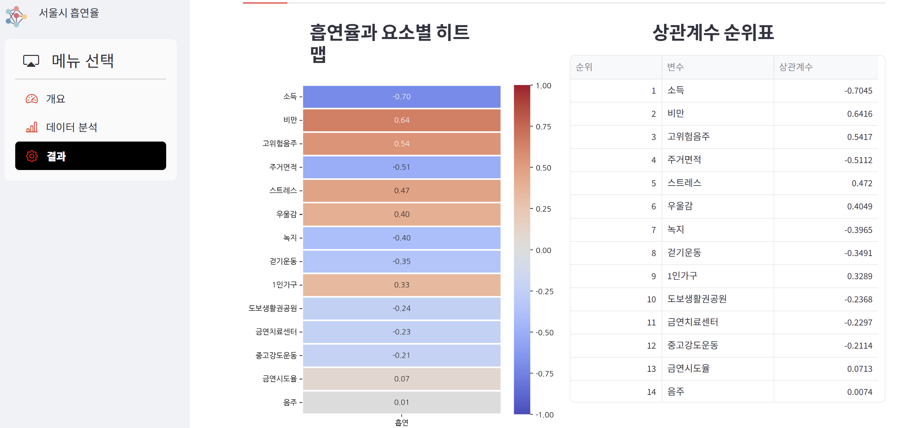

# smoke_analyze

# 🚬 흡연 데이터 분석 및 시각화 대시보드 (Smoke Analyze)


## 📖 프로젝트 소개
이 프로젝트는 **흡연 관련 데이터**를 분석하고, 그 결과를 **Streamlit**을 이용해 웹 대시보드로 시각화한 프로젝트입니다.
Jupyter Notebook을 통해 데이터 전처리 및 탐색적 분석(EDA)을 수행하였으며, 사용자가 직접 데이터를 탐색할 수 있도록 인터랙티브한 웹 페이지를 구현했습니다.

## 🔗 실행 주소
웹 브라우저에서 바로 결과를 확인해보세요!
👉 **[Streamlit 앱 보러가기](https://smokeanalyze-nzeqhfewkfiel7iy5qz5cq.streamlit.app/)**

## 💡 주요 분석 결과
* **"소득 수준이 흡연율과 가장 높은 상관관계를 보였습니다."**
* 여러 요인(녹지 면적, 스트레스, 주거 면적, 음주 등)을 분석한 결과, 자치구별 **평균 연봉(소득)** 데이터가 흡연율에 가장 큰 영향을 미치는 핵심 지표로 나타났습니다. 대시보드의 '결과' 탭에서 자세한 상관계수 순위와 히트맵을 확인하실 수 있습니다.

## 🖥️ 실행 화면
> 대시보드 작동 모습입니다.



## 📂 파일 구조
```text
📦 smoke_analyze
 ┃ 📂 module/
 ┃  ┣ 📂 data/
 ┃  ┃  ┗ 📜 final_df.csv
 ┃  ┗ 📜 test1.py          # 🎨 Streamlit 대시보드 실행 코드
 ┣ 📜 smoke_analyze.ipynb  # (Jupyter)     
 ┣ 📜 requirements.txt     # 📦 필요한 라이브러리 목록
 ┗ 📜 README.md            # 📄 프로젝트 설명 파일
```

### 개발자
1. 김동혁 : ehdgur100@gmail.com
2. 김휘주 : khj41670@gmail.com
3. 백세현 :
4. 이예경 :